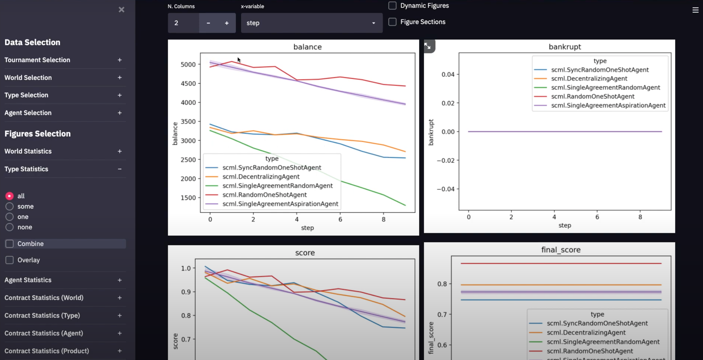
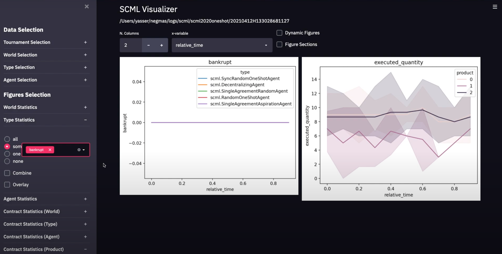
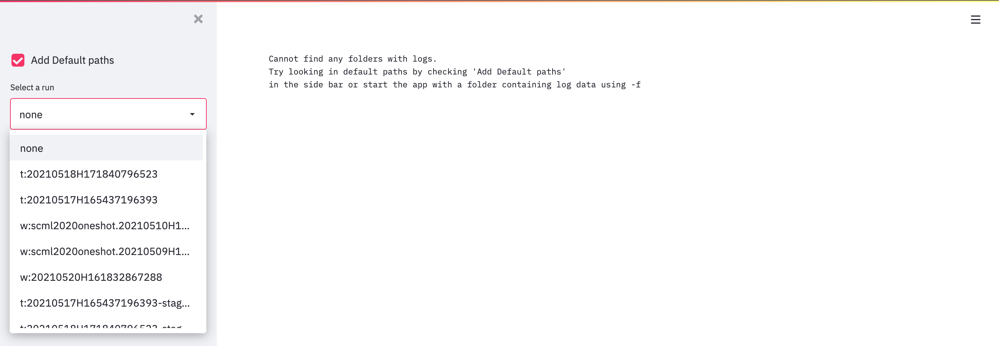
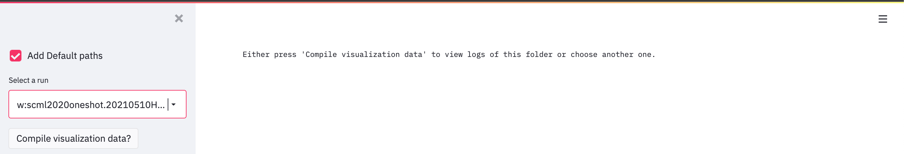
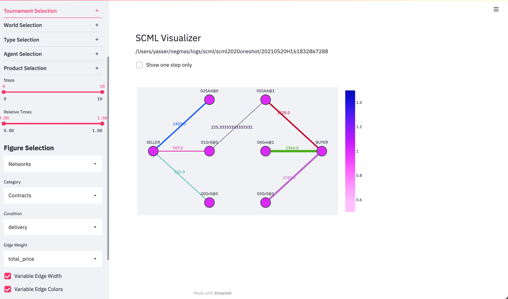
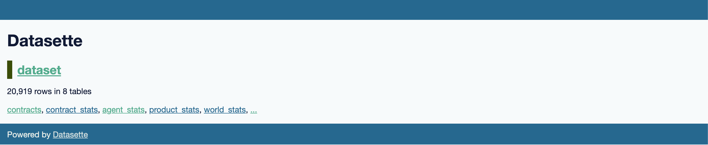
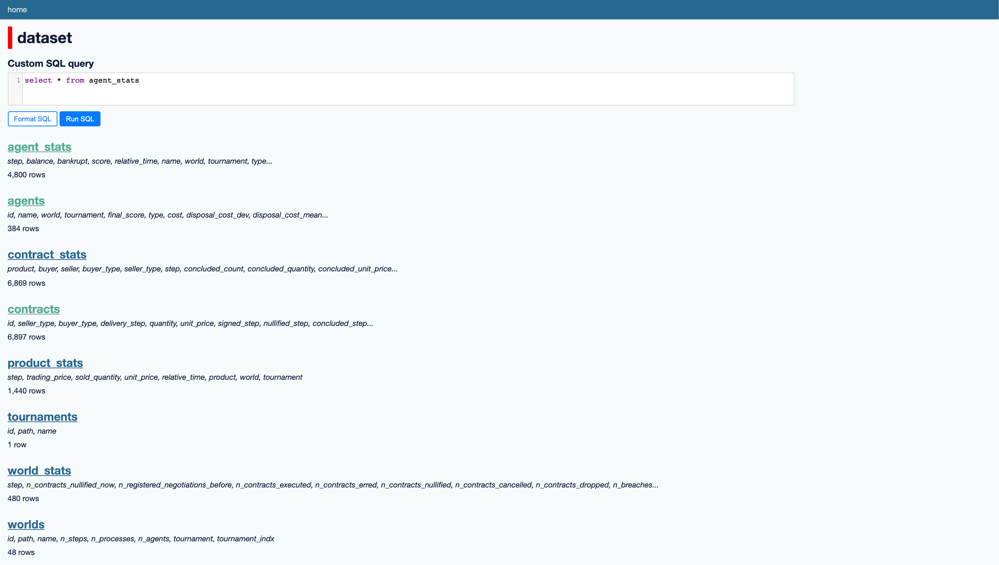

# scml-vis

[](https://github.com/yasserfarouk/scml-vis/actions/workflows/main.yml)
[](https://scml-vis.github.io/scml-vis/)
[](https://pypi.org/project/scml-vis/)
[](https://gitter.im/scml-vis/community)

A simple visualiser for SCML worlds and tournaments.
You can watch [a demo on YouTube](https://youtu.be/BCDjnnSmIsk)
[](https://youtu.be/BCDjnnSmIsk)
<!-- <iframe width="560" height="315" src="https://www.youtube.com/embed/BCDjnnSmIsk" title="YouTube video player" frameborder="0" allow="accelerometer; autoplay; clipboard-write; encrypted-media; gyroscope; picture-in-picture" allowfullscreen></iframe> -->
<!--  -->
## Screenshots



## Main Features

- Displays any world/tournament run using the [SCML package](https://www.github.com/yasserfarouk/scml)
- Allows filtering using worlds, agent types, and agent instances
- Shows world statistics, agent type and instance statistics and contract
  statistics as functions of simulation step/time


## Requirements

- scml-vis requires Python 3.8 or above.
- scml-vis can visualize worlds created by [scml](https://github.com/yasserfarouk/scml) 0.4.2 or later (simulations created using older versions of scml can be visualized in most cases but are not officially supported).

## Installation

With `pip`:
```bash
python3 -m pip install scml-vis
```

With [`pipx`](https://github.com/pipxproject/pipx):
```bash
python3 -m pip install --user pipx

pipx install scml-vis
```

## Usage

The visualizer can be run using any of the following commands:
```bash
scmlv
scmlvis
scml-vis
```
Hereafter we will use the shorter version.

- To visualize any of the recently run worlds and tournaments just run:
	```bash
	scmlv show
	```
	This will open your browser and allow you to choose a world or a tournament to
	display.
	

	- If this is the first time you visualize logs in this folder, you will be asked
	  to compile visualization data
		
	- If visualization data is available (or your pressed the `compile visualization data` button), you can now start visualizing the logs
		
- To visualize the logs in a specific folder, you can directly pass the folder as in:
  ```bash
	scmlv show -f path-to-your-folder
	```
- It is also possible to just compile visualization data without running the visualizer using:
  ```bash
	scmlv compile path-to-your-folder
	```
- The visualizer creates a database that it uses to create all the figures you see. You can directly explore this database using:
  ```bash
	scmlv explore path-to-your-folder
	```
	This will open a [datasette](https://docs.datasette.io/en/stable/getting_started.html) page allowing you to explore this database
	
	This dataset will contain 8 tables describing everything that was logged in the world or tournament. 
	
	Please consult [datasette documentation](https://docs.datasette.io/en/stable/getting_started.html) for all the ways you can interact with this dataset.

## Available visualizations

To visualize your logs, you need to follow three steps:

1. Filter the dataset using the `Data Selection` section of the sidebar.
2. Choose the **family** of figures you would like to show from the `Figure Selection` dropdown in the sidebar. Currently we provide `Time-series`, `Tables` and `others` that are always available as well as `Networks`  that are only available when you visualize a single world or filter the tournament to focus on a single world.
3. Choose the specific graph you want to see from the family selected in the previous step.

You can watch [a demo of this process here](https://youtu.be/BCDjnnSmIsk)

## TODO List (Good Ideas for PRs)

- ~~Show negotiation logs (i.e. negotiation results)~~
- ~~Display all contracts (i.e. in a table) based on selection criteria~~
- ~~Zoom on negotiation details (i.e. exchanged offers)~~
- ~~Add dynamic figures using plotly/altair~~
- ~~Add networkx like graphs of contracts / negotiations / offers~~
- ~~Allow starting the app without specifying a folder.~~
- Add saving and loading of the visualizer's state (i.e. what is visible).
- Add new figure types that do not have time/step in the x-axis.
- Correcting the placement of weights on edges in network views.
- Adding a graph showing negotiation history in the ufun-space of negotiators (will require a change in the scml package).
- Resolving the strange behavior of CI bands in plotly in some cases.
